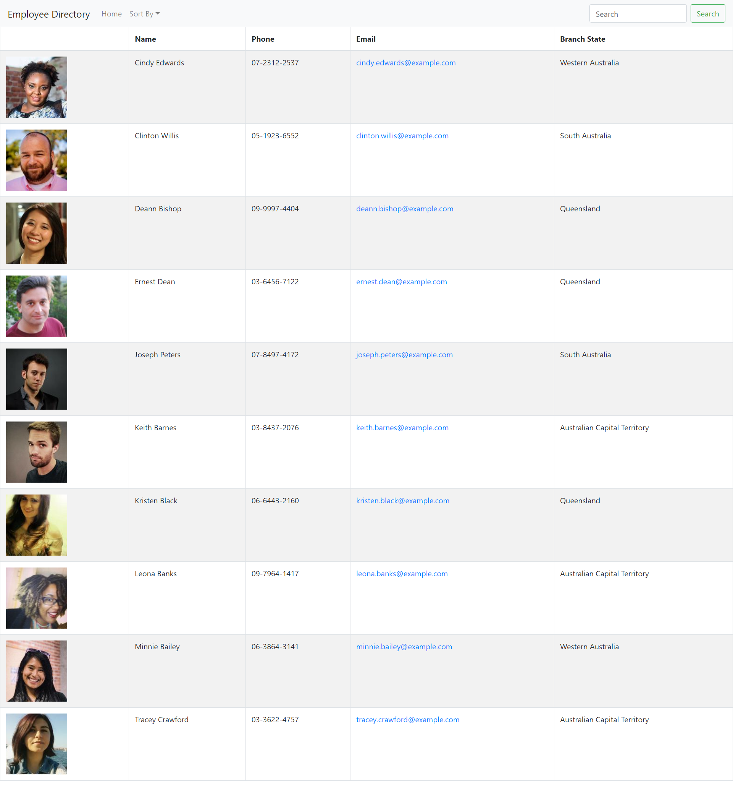

   
   
   
   
   
   
  

  # Welcome to Budget Tracker

  ## Table of Contents

  * [Description](#Description)
  * [Demonstration](#Demonstration)
  * [Setup](#Setup)
  * [Usage](#Usage)
  * [License](#License)
  * [Contributions](#Contributions)
  * [Version](#Version)
  * [Tests](#Tests)
  * [Questions](#Questions)

  ## Description

  This is an application to that demonstates the use of React.js to create an interactive and dynamic employee directory. The page allows users to sort employees by first name, last name or the state of their branch. The application is built to be modular to allow reuse of components for future expansion or use elsewhere.

  ## Demonstration

  Access the live application here: https://fast-anchorage-29235.herokuapp.com/.

  #### Screenshot

  

  ## Setup

  To install locally, clone the repository and then run `npm i` to install required packages. To run the application, run `npm start`. The live application can be accessed using the link provided above. No installation is necessary. The app can be saved in the applications menu of mobile devices by selecting `Add to home screen` or a similar option.

  ## Usage

  Enter your transaction reference and amount. Then hit add or subtract to log it.

  ## License

  

  You may utilize this application under the terms of the [MIT license](public/license/MIT.txt).

  ## Contributions

  Make a pull request for suggested changes or fixes and I will review and approve it as necessary.

  ## Version

  

  ## Tests

  No tests available currently.

  ## Questions

  If you have further questions or would like to see more features, please contact me via github or email:

  https://github.com/bdcoelho 

  ben_coelho@hotmail.com
  
